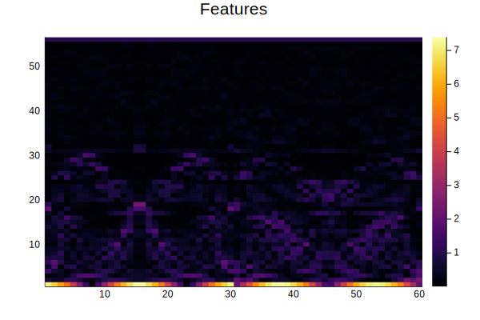
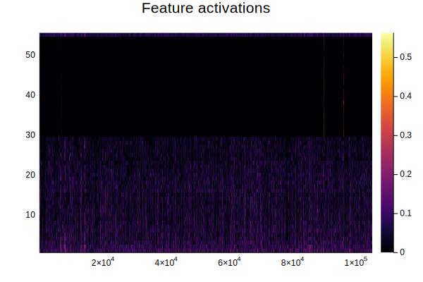
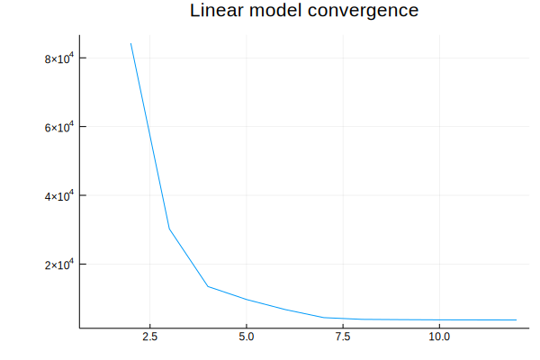

[](https://baggepinnen.github.io/SpectralDistances.jl/latest)

# AudioClustering
This package contains experiments and utilities for unsupervised learning on acoustic recordings. This package is a use case of [SpectralDistances.jl](https://github.com/baggepinnen/SpectralDistances.jl)

## Installation

```julia
using Pkg
pkg"add https://github.com/baggepinnen/DetectionIoTools.jl"
pkg"add https://github.com/baggepinnen/AudioClustering.jl"
```

# Examples

## Estimating linear models
The following code illustrates how to use [SpectralDistances.jl](https://github.com/baggepinnen/SpectralDistances.jl) to fit rational spectra to audio samples and extract the poles for use as features
```julia
using SpectralDistances, Glob
path      = "/home/fredrikb/birds/" # path to a bunch of wav files
cd(path)
files     = glob("*.wav")
const fs  = 44100
na        = 20
fitmethod = LS(na=na)

models    = mapsoundfiles(files) do sound
     sound = SpectralDistances.bp_filter(sound, (50/fs, 18000/fs))
     SpectralDistances.fitmodel(fitmethod, sound)
end
```
We now have a vector of vectors with linear models fit to the sound files. To make this easier to work with, we flatten this structure to a single long vector and extract the poles (roots) of the linear systems to use as features
```julia
X = embeddings(models)
```

We now have some audio data, represented as poles of rational spectra, in a matrix `X`. See https://baggepinnen.github.io/SpectralDistances.jl/latest/examples/#Examples-1 for examples of how to use this matrix for analysis of the signals, e.g., classification, clustering and detection.


## Graph-based clustering
A graph representation of `X` can be obtained with
```julia
G = audiograph(X, 5; λ=0)
```
where `k=5` is the number of nearest neighbors considered when building the graph. If `λ=0` the graph will be weighted by distance, whereas if  `λ>0` the graph will be weigted according to adjacency under the kernel `exp(-λ*d)`. The metric used is the Euclidean distance. If you want to use a more sophisticated distance, try, e.g.,
```julia
dist = OptimalTransportRootDistance(domain=Continuous(), p=2)
G = audiograph(X, 5, dist; λ=0)
```
Here, the Euclidean distance will be used to select neighbors, but the edges will be weighted using the provided distance. This avoids having to calculate a very large number of pairwise distances using the more expensive distance metric.

Any graph-based algorithm may now operate on `G`, or on the field `G.weight`. Further examples are available [here](https://baggepinnen.github.io/SpectralDistances.jl/latest/examples/#Pairwise-distance-matrix-1).


## Distance matrix-based clustering
See docs entry [Clustering using a distance matrix](https://baggepinnen.github.io/SpectralDistances.jl/latest/taskview/#Clustering-using-a-distance-matrix-1)

## Feature-based clustering
See docs entry [Clustering using features](https://baggepinnen.github.io/SpectralDistances.jl/latest/taskview/#Clustering-using-features-1)


## Accelerated k-nearest neighbor
```julia
inds, dists, D = knn_accelerated(dist, X, k, Xe=X; kwargs...)
```

Find the nearest neighbor from using distance metric `dist` by first finding the `k` nearest neighbors using Euclidean distance on embeddings produced from `Xe`, and then using `dist` do find the smallest distance within those `k`.

`X` is assumed to be a vector of something `dist` can operate on, such as a vector of models from SpectralDistances. `Xe` is by default the same as `X`, or possibly something else, as long as `embeddings(Xe)` is defined. A vector of models or spectrograms has this function defined.

`D` is a sparse matrix with all the computed distances from `dist`. This matrix contains raw distance measurements, to symmetrize, call `SpectralDistances.symmetrize!(D)`. The returned `dists` are already symmetrized.

<!-- ## Low-rank model
To derive some insights into the data, we may attempt to fit a low-rank model. I have chosen some (hopefully) resonable defaults in the function `lowrankmodel`, but more control can always be recovered by using [LowRankModels.jl](https://github.com/madeleineudell/LowRankModels.jl) directly.
```julia
using AudioClustering
U,V,ch = AudioClustering.lowrankmodel(X; λ=0.00001)
heatmap(abs.(U), title="Features")
heatmap(abs.(sqrt.(abs.(V[2:end,:]))), title="Feature activations")
plot(ch.objective, lab="", title="Linear model convergence")

julia> mean(abs2, X - U'V)
0.0005889785344933411
```




The model `X ≈ U'V` has a nice sparse structure. Features 30 and upward are mostly not activated, apart from for a small number of clips.

We might for instance want to inspect the audio clip that has the largest activation of feature 35
```julia
ind = findmax(V[35,:])[2]
file = AudioClustering.model2file(modelsv[ind], models, files)
wavplay(file)
```
(it sounds funny) -->
